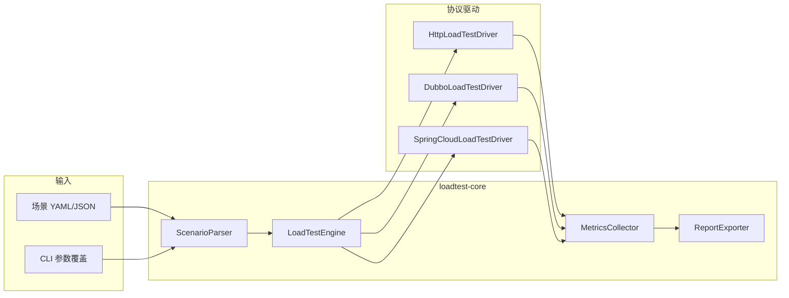

# 压测工具设计（mdyaipay-tools-loadtest）

## 目标

在 `mdyaipay-tools` 下提供**可嵌入、可 CLI 运行**的压测能力，面向 mdyaipay 及周边服务的性能验证：

1. 支持 **HTTP/HTTPS**、**Dubbo 泛化调用**、**Spring Cloud**（经 Gateway / LoadBalancer / OpenFeign 访问）三类协议；
2. **负载与指标均可配置**（YAML/JSON 场景文件 + 可选运行时覆盖），不硬编码压测参数；
3. 输出**结构化 + 人类可读**的压测报告（控制台摘要、JSON、Markdown/HTML），便于 CI 归档与对比。

与 `@TimeTrace`（单请求调用链诊断）互补：TimeTrace 看**一次调用的内部耗时树**；Loadtest 看**大量并发下的吞吐、延迟分布与错误率**。

## 非目标（首版）

- 不做分布式多机协调压测（后续可接 Gatling/k6 或自研 Coordinator）；
- 不做录制回放、不做 GUI；
- 不替代生产 APM（仅离线/预发压测工具）。

## 模块结构

```
mdyaipay-tools-loadtest/                 (packaging=pom)
├── mdyaipay-tools-loadtest-core         引擎、指标、报告、SPI
├── mdyaipay-tools-loadtest-http         Java HttpClient 驱动
├── mdyaipay-tools-loadtest-dubbo        Dubbo GenericService 驱动
├── mdyaipay-tools-loadtest-springcloud  RestClient + LB/Feign 驱动
└── mdyaipay-tools-loadtest-cli          聚合依赖 + exec 入口
```

| Artifact | 包根 | 职责 |
|----------|------|------|
| `loadtest-core` | `com.mdyaipay.tools.loadtest` | 场景模型、引擎、指标聚合、报告导出、`LoadTestDriver` SPI |
| `loadtest-http` | `com.mdyaipay.tools.loadtest.http` | HTTP 方法、Header、Body、TLS、连接池 |
| `loadtest-dubbo` | `com.mdyaipay.tools.loadtest.dubbo` | 注册中心、接口名、方法、参数类型与 JSON 参数 |
| `loadtest-springcloud` | `com.mdyaipay.tools.loadtest.springcloud` | 服务名解析、Feign 或 `@LoadBalanced` RestClient |
| `loadtest-cli` | `com.mdyaipay.tools.loadtest.cli` | 解析场景、注册驱动、写报告文件 |

**依赖原则**：core 不依赖 Spring/Dubbo；各 driver 仅依赖 core + 对应协议栈；业务模块**不**反向依赖 loadtest（压测为独立工具链）。

## 架构



### 核心流程

1. **解析** `LoadTestPlan`：名称、协议、`LoadProfile`、`MetricsProfile`、`target`（协议相关键值）。
2. **解析驱动**：`LoadTestDriverRegistry` 通过 `ServiceLoader` 加载 `META-INF/services/com.mdyaipay.tools.loadtest.spi.LoadTestDriver`。
3. **预热**：在 `metrics.warmupSeconds` 内采样**不计入**正式报告（可选仍打印进度）。
4. **压测**：按负载模型调度虚拟用户，每次调用 `LoadTestDriver.execute(plan, context)`，得到 `SampleOutcome`。
5. **汇总**：计算 TPS、成功/失败数、可配置分位数延迟、错误采样列表。
6. **导出**：`LoadTestReport` → JSON / Markdown / 可选 HTML 模板。

## SPI：`LoadTestDriver`

```java
public interface LoadTestDriver {
    String protocol();
    SampleOutcome execute(LoadTestPlan plan, LoadTestRunContext runContext) throws Exception;
}
```

- `protocol()` 与场景文件中 `protocol` 字段一致（小写）：`http`、`dubbo`、`springcloud`。
- 驱动内部只负责**单次调用**；并发、Ramp-up、Think time 由 **Engine** 统一实现，避免各协议重复逻辑。

## 场景文件（动态配置）

建议文件名：`scenarios/*.yaml`。示例（HTTP）：

```yaml
name: gateway-health
protocol: http
load:
  threads: 50
  durationSeconds: 120
  rampUpSeconds: 30
  thinkTimeMillis: 0
  targetRps: null          # 非空时启用恒定速率（与 threads 二选一为主模式）
metrics:
  percentiles: [0.5, 0.9, 0.95, 0.99]
  warmupSeconds: 10
  recordErrors: true
  maxErrorSamples: 200
target:
  url: http://127.0.0.1:8080/actuator/health
  method: GET
  headers:
    Accept: application/json
  timeoutMillis: 5000
  expectStatus: [200]
report:
  formats: [console, json, markdown]
  outputDir: target/loadtest-reports
```

HTTP `target` 的 `url`、`body`、Header 值支持占位符：`${iteration}`（全局采样序号）、`${threadIndex}`（虚拟用户索引），便于收单/代扣/代付等幂等键压测。

本地 `mdyaipay-gateway`（JDK `MdyaipayGatewayServer`，默认 **8041**）示例场景见 `scenarios/gateway-*.yaml`：`health`、`collect`、`ids/next`、`withhold`、`payout`。

### Dubbo `target` 字段（规划）

| 键 | 说明 |
|----|------|
| `registryAddress` | 如 `nacos://127.0.0.1:8848` |
| `interfaceName` | 服务接口 FQCN |
| `method` | 方法名 |
| `parameterTypes` | Java 类型名数组 |
| `argsJson` | 参数 JSON 数组（泛化调用） |
| `group` / `version` | 可选 |

### Spring Cloud `target` 字段（规划）

| 键 | 说明 |
|----|------|
| `mode` | `direct-url` \| `loadbalancer` \| `feign` |
| `serviceId` | 注册中心服务名（LB/Feign） |
| `path` | 请求路径 |
| `discovery` | 如 `simple`（静态列表）或 `nacos`（实现阶段对接） |

CLI 覆盖（规划）：`--load.threads=100`、`--metrics.percentiles=0.99,0.999`，点号路径写入 Plan 副本后再运行。

## 负载模型

| 参数 | 含义 |
|------|------|
| `threads` | 并发虚拟用户数（固定线程池） |
| `durationSeconds` | 正式阶段最长运行时间 |
| `rampUpSeconds` | 线性递增到满并发的时间 |
| `thinkTimeMillis` | 每次采样成功后休眠（模拟用户间隔） |
| `targetRps` | 若设置，Engine 使用全局速率限制器（令牌桶），与 threads 配合封顶 |

Engine 实现要点：

- 使用 `ExecutorService` + 每线程循环，直到全局截止时间；
- Ramp-up：`thread i` 延迟 `i * (rampUpSeconds / threads)` 启动；
- 中断：CLI `Ctrl+C` 触发 graceful shutdown，仍输出阶段性报告。

## 指标（动态）

`MetricsProfile` 控制：

| 配置 | 默认 | 说明 |
|------|------|------|
| `percentiles` | 0.5, 0.9, 0.95, 0.99 | HDR 或 t-digest 近似分位数 |
| `warmupSeconds` | 10 | 预热不计入报告 |
| `recordErrors` | true | 是否收集错误消息 |
| `maxErrorSamples` | 100 | 错误明细上限，防 OOM |

**采集项（写入 `LoadTestReport`）**：

- 总采样数、成功数、失败数、错误率；
- 吞吐（RPS，基于正式阶段 wall time）；
- 延迟：min / max / mean / 各配置分位数（毫秒）；
- 可选：按秒时间序列（v2，`timeSeries` 数组，便于画图）。

实现建议：正式阶段使用 **HdrHistogram** 或自研 `LongAdder` + 采样 reservoir；首版可用排序数组窗口（样本上限 100k）换简单性。

## 报告

### 控制台

简要表格：TPS、P50/P90/P99、错误率、耗时区间。

### JSON

机器可读，字段与 `LoadTestReport` record 一致，便于 CI 阈值门禁（如 `p99 < 500ms`）。

### Markdown

含场景摘要、指标表、错误 Top N，可 checked in 到 `docs/perf/` 或 CI artifact。

### HTML（可选阶段）

单文件模板 + 内联 CSS，可选简单 Chart.js 折线（若启用 timeSeries）。

**导出接口（规划）**：

```java
public interface ReportExporter {
    void export(LoadTestReport report, Path outputDir, List<String> formats);
}
```

## 各协议驱动设计要点

### HTTP（`loadtest-http`）

- `java.net.http.HttpClient`，共享连接池，可配置 HTTP/2；
- 支持 JSON/text body、自定义 Header、TLS trust（测试环境可 `insecure` 开关，**默认 false**）；
- 成功判定：`expectStatus` + 可选 body 子串/JSONPath（v2）。

### Dubbo（`loadtest-dubbo`）

- **GenericService** 避免依赖业务 API jar；
- 短连接 vs 长连接：压测默认**连接复用**，与生产客户端行为一致；
- 超时、重试在 `target` 中显式配置，默认重试 0。

### Spring Cloud（`loadtest-springcloud`）

- **direct-url**：等价 HTTP，仅命名区分场景；
- **loadbalancer**：最小化 Spring 上下文，静态 `SimpleDiscoveryClient` 或测试用 Nacos；
- **feign**：动态 Feign.Builder + 硬编码 URL/LB（不扫描业务 `@FeignClient`）。

与现有 `mdyaipay-gateway`（Spring Cloud Gateway）配合：HTTP 场景直接打 Gateway 地址即可覆盖「Spring Cloud 入口」路径；专用 driver 用于**服务间** Feign/LB 压测。

## 与 TimeTrace 协作（可选）

在**被压服务**依赖 `mdyaipay-tools-timetrace` 且开启 `@TimeTrace` 时，压测期间可采样慢请求的内部调用树；Loadtest 报告中的高 P99 时段与 TimeTrace 日志关联分析。两者无编译期耦合。

## 测试策略

| 层级 | 内容 |
|------|------|
| core 单测 | 指标分位数、Ramp-up 调度、报告序列化 |
| driver 单测 | Mock WebServer（HTTP）、嵌入式 Dubbo（可选）、WireMock |
| 集成 | 对本地 `mdyaipay-gateway` 的 health 场景，CI 可选 `-Ploadtest-it` |

## 构建与运行（规划）

```bash
# 构建全部 loadtest 子模块
mvn -pl mdyaipay-tools/mdyaipay-tools-loadtest -am test

# 运行 CLI（需先启动被压服务，如 mdyaipay-gateway）
cd mdyaipay-tools/mdyaipay-tools-loadtest/mdyaipay-tools-loadtest-cli
mvn -q exec:java -Dexec.args="../scenarios/gateway-health.yaml --load.threads=10"
```

CI 门禁示例（伪代码）：解析 `target/loadtest-reports/gateway-health.json`，断言 `latencyPercentilesMillis["0.99"] < 500` 且 `errorRate == 0`。

当前仓库状态：**M1–M5 已实现**（Engine、YAML 场景、HTTP/Dubbo/Spring Cloud 驱动、console/json/markdown/html 报告、CLI 参数覆盖）。示例场景见 `mdyaipay-tools-loadtest/scenarios/gateway-health.yaml`。

## 实现阶段建议

| 阶段 | 交付 |
|------|------|
| M1 | `LoadTestEngine`、`MetricsCollector`、`ReportExporter`（console + JSON） |
| M2 | `HttpLoadTestDriver` + 示例 YAML + 对 gateway 的集成说明 |
| M3 | `DubboLoadTestDriver` |
| M4 | `SpringCloudLoadTestDriver`（direct-url + static LB） |
| M5 | Markdown/HTML、CLI 参数覆盖、CI 门禁示例 |

## 风险与约束

- **压测仅限授权环境**；CLI 文档需强调禁止对生产未审批地址施压；
- Dubbo/Spring 依赖较重，保持 **optional** 与分模块，避免污染 `loadtest-core`；
- 高线程数时注意文件句柄与 `HttpClient` 连接池上限，场景文件可配置 `maxConnections`。
