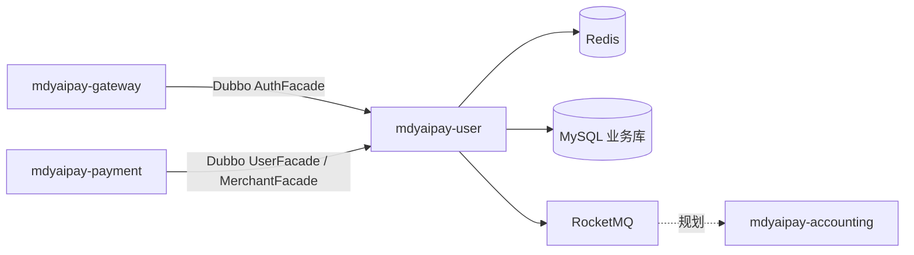

# 用户系统设计（方案 2：MySQL + Redis 会话 + RocketMQ 审核事件）

> 依据 `docs/user/exported_image*.png`（ER、微服务架构、交易资金流）与现有 `mdyaipay-payment` 分层惯例。  
> **范围（已确认）：** 用户主体 / 登录账号 / 实名 / 地址 + 登录会话 + 商户审核状态机 / 审核记录 / 店铺 / 成员 RBAC；**钱包与流水归属 `mdyaipay-accounting`**，资质文件与结算账户本期不做。

---

## 1. 目标与非目标

### 1.1 目标

- 在 `mdyaipay-user-api` + `mdyaipay-user` 内实现 **服务层 → domain 层 → dao 层**，持久化 **MySQL**。
- 对外通过 **Dubbo 3.3.x** 暴露 `UserFacade`、`AuthFacade`、`MerchantFacade`（接口与 DTO 仅在 api 模块）。
- **Redis**：登录态、令牌校验、会话踢出/续期；可选短 TTL 缓存用户档案读路径。
- **RocketMQ**：商户审核结果等领域事件，支持网关/通知/搜索等下游 **最终一致**；关键状态迁移采用 **本地事务 + 事务消息**（或先发后查的 Outbox 表，见 §6.3）。
- 与支付链路衔接：`payment` 代扣校验 `agreementNo`、订单带 `user_id` / `shop_id` 时，经 Dubbo 查用户/店铺/成员权限（规划接口，本期可先 stub）。

### 1.2 非目标（第一期）

- `user_wallet` / `wallet_txn_log`（账务模块）。
- `merchant_qualification`、`merchant_settlement_account`。
- 独立 `auth-service` 进程（逻辑边界保留，物理部署仍在 `mdyaipay-user` 单进程，便于演进拆分）。
- Elasticsearch 用户/商户搜索（仅通过 MQ 事件预留接入）。
- 生产级 Nacos / 多活（本地与 CI 可用 **Dubbo 直连** + 嵌入式/ Testcontainers）。

---

## 2. Maven 模块与依赖

| 模块 | ArtifactId | 职责 |
|------|------------|------|
| API | `mdyaipay-user-api` | Dubbo `@DubboService` 接口、`Serializable` DTO、错误码常量；**无** Spring/MyBatis/Redis 依赖 |
| 实现 | `mdyaipay-user` | Spring Boot 启动、`service` / `domain` / `dao`、Dubbo Provider、Redis/MQ 适配 |

**依赖方向：**

```text
mdyaipay-gateway / mdyaipay-payment / mdyaipay-cashier
        ↓ (仅依赖)
mdyaipay-user-api
        ↑ (实现)
mdyaipay-user → mdyaipay-tools-common, spring-boot, mybatis, mysql, dubbo, redis, rocketmq-spring
```

父 POM `dependencyManagement` 增加：`mdyaipay-user-api`、`dubbo.version`（与 loadtest-dubbo 对齐 **3.3.2**）、`rocketmq-spring-boot-starter` 版本（与 Spring Boot 3.5.x 兼容的一版，实现阶段锁定）。

---

## 3. 包结构（三层 + 适配）

```text
com.mdyaipay.user                          # Boot 入口 MdyaipayUserApplication，默认端口 8082
├── api.dubbo                              # Dubbo Provider 实现（薄：转调 service，不做领域规则）
├── service                                # 应用服务（编排、幂等、调 domain + 端口）
│   ├── profile                            # 用户档案、地址
│   ├── auth                               # 注册、登录、登出、令牌校验
│   └── merchant                           # 商户、店铺、成员、审核
├── domain                                 # 聚合、枚举、仓储 *接口*、领域服务
│   ├── user                               # User, UserAccount, UserIdentity, UserAddress
│   ├── auth                               # Session 领域模型（逻辑会话，非 Redis 细节）
│   └── merchant                           # Merchant, Shop, MerchantMember, MerchantAuditRecord
├── dao                                    # MyBatis 实现 *Repository*、Row、Mapper、XML
├── integration                            # Redis SessionStore、RocketMQ EventPublisher、AES 加解密
└── config                                 # Dubbo、Redis、MQ、数据源、init-schema
```

命名说明：与 `payment` 的 `repository` 包等价层在本设计中统一称为 **dao**（满足「dao 层」表述）；实现风格与 `MyBatis*Repository` 一致。

---

## 4. 领域模型与不变量

### 4.1 用户域（统一主体 `user`）

| 聚合 / 实体 | 说明 | 关键不变量 |
|-------------|------|------------|
| `User` | 统一用户主体，`userId`（雪花或 BIGINT） | 状态 `ACTIVE` / `FROZEN` / `CLOSED`；关闭后不可登录 |
| `UserAccount` | 登录账号 1:N | 类型 `PHONE` / `EMAIL` / `WECHAT_OPENID`；同一 `(type, login_key)` 全局唯一；密码仅存 **BCrypt** hash |
| `UserIdentity` | 实名 0..1 | 姓名 + 证件号 **AES 密文** + 脱敏展示字段；已认证不可随意改证件号（需走重新认证流程，第一期可拒绝修改） |
| `UserAddress` | 收货地址 1:N | 每用户至多一个 `default_flag=1`（设默认时清其它） |

### 4.2 认证域（会话）

| 概念 | 说明 |
|------|------|
| `AccessToken` |  opaque 随机串或 JWT（**第一期推荐 opaque + Redis**），关联 `userId`、`sessionId`、过期时间 |
| `UserSession` | 逻辑会话：设备/客户端类型、创建时间、最后活跃；登出 = 删除 Redis + 会话表置 `REVOKED` |

登录成功：**写 MySQL `user_session`（审计）+ 写 Redis（热路径校验）**。校验令牌只读 Redis；Miss 时可回查 DB（可选，第一期 Redis 为准）。

### 4.3 商户域（审核状态机 + 店铺 + 成员）

**Merchant 状态：**

```text
DRAFT → PENDING → APPROVED → (ENABLED / DISABLED 运营态)
              ↘ REJECTED → (可编辑回 DRAFT，再提交 PENDING)
```

- `submitAudit()`：仅 `DRAFT` / `REJECTED` → `PENDING`。
- `approve(auditor)`：仅 `PENDING` → `APPROVED`，并写 `merchant_audit_record`。
- `reject(auditor, remark)`：仅 `PENDING` → `REJECTED`，写审核记录。
- `disable()` / `enable()`：仅 `APPROVED` 商户在 `ENABLED` ↔ `DISABLED`（不影响历史订单）。

**Shop：** 归属 `merchant_id`；字段：名称、类目、**营业状态** `OPEN` / `CLOSED`（第一期不做复杂排班）。

**MerchantMember：** `(merchant_id, user_id)` 唯一；角色 `OWNER` / `OP` / `FIN`；**复用统一 `user` 主体**（ER 图 N:1）。OWNER 不可通过普通 OP 接口删除（需转让或平台操作）。

### 4.4 商户开放 API 签名（验签）

商户侧调用（提交审核、建店、改营业状态、加成员等）必须携带 `MerchantSignEnvelope`：

| 字段 | 说明 |
|------|------|
| `appKey` | 平台签发，表 `merchant_api_credential` |
| `timestampMillis` | Unix 毫秒，偏移默认 ±300s（`user.merchant.sign.max-skew-seconds`） |
| `nonce` | 防重放，调用方唯一 |
| `signMethod` | 固定 `HMAC_SHA256` |
| `sign` | 十六进制小写 |

**Canonical：** 将 `app_key`、`timestamp`、`nonce`、`sign_method` 与业务参数字符串（如 `merchant_id`、`shop_name`）合并为 Map，按 key 字典序拼接为 `k1=v1&k2=v2`（不含 `sign`），再 `HMAC-SHA256(appSecret, canonical)`。

**密钥：**

- 平台接口 `issueApiCredential` 签发 `appKey` + `appSecret`（**secret 仅响应一次**）。
- 落库 `secret_cipher` 使用 AES-GCM，密钥 `USER_AES_KEY`（配置 `user.crypto.aes-key`）。
- 草稿态商户可签发密钥，用于 **提交审核** 等审前接口；`DISABLED` 商户禁止签发且验签拒绝。

**不验签：** 平台 `createMerchant`、`approveMerchant`、`rejectMerchant`、`issueApiCredential`（走内网/平台鉴权，后续 Dubbo 可加 provider 侧 filter）。

---

## 5. MySQL 表设计（业务库）

字符集 `utf8mb4`，InnoDB；时间 `TIMESTAMP(3)` UTC；金额若出现仍用 **分 BIGINT**（本模块暂无）。

```sql
-- 用户主体
CREATE TABLE user (
    user_id       BIGINT       NOT NULL PRIMARY KEY,
    nickname      VARCHAR(64)  NULL,
    avatar_url    VARCHAR(512) NULL,
    status        VARCHAR(16)  NOT NULL,
    created_at    TIMESTAMP(3) NOT NULL,
    updated_at    TIMESTAMP(3) NOT NULL,
    KEY idx_user_status_created (status, created_at)
);

CREATE TABLE user_account (
    account_id    BIGINT       NOT NULL PRIMARY KEY,
    user_id       BIGINT       NOT NULL,
    account_type  VARCHAR(16)  NOT NULL,
    login_key     VARCHAR(128) NOT NULL,
    password_hash VARCHAR(128) NULL,
    created_at    TIMESTAMP(3) NOT NULL,
    UNIQUE KEY uk_user_account_type_key (account_type, login_key),
    KEY idx_user_account_user (user_id)
);

CREATE TABLE user_identity (
    user_id           BIGINT       NOT NULL PRIMARY KEY,
    real_name         VARCHAR(64)  NOT NULL,
    id_number_cipher  VARBINARY(256) NOT NULL,
    id_number_mask    VARCHAR(32)  NOT NULL,
    verified_at       TIMESTAMP(3) NOT NULL,
    created_at        TIMESTAMP(3) NOT NULL,
    updated_at        TIMESTAMP(3) NOT NULL
);

CREATE TABLE user_address (
    address_id    BIGINT       NOT NULL PRIMARY KEY,
    user_id       BIGINT       NOT NULL,
    recipient     VARCHAR(64)  NOT NULL,
    region_code   VARCHAR(32)  NOT NULL,
    detail        VARCHAR(256) NOT NULL,
    default_flag  TINYINT(1)   NOT NULL DEFAULT 0,
    created_at    TIMESTAMP(3) NOT NULL,
    updated_at    TIMESTAMP(3) NOT NULL,
    KEY idx_user_address_user (user_id)
);

CREATE TABLE user_session (
    session_id    BIGINT       NOT NULL PRIMARY KEY,
    user_id       BIGINT       NOT NULL,
    token_hash    CHAR(64)     NOT NULL COMMENT 'SHA-256(access_token)，不落明文 token',
    client_type   VARCHAR(32)  NULL,
    status        VARCHAR(16)  NOT NULL,
    expires_at    TIMESTAMP(3) NOT NULL,
    created_at    TIMESTAMP(3) NOT NULL,
    revoked_at    TIMESTAMP(3) NULL,
    KEY idx_user_session_user (user_id),
    KEY idx_user_session_expires (expires_at)
);

-- 商户
CREATE TABLE merchant (
    merchant_id   BIGINT       NOT NULL PRIMARY KEY,
    name          VARCHAR(128) NOT NULL,
    status        VARCHAR(16)  NOT NULL,
    created_at    TIMESTAMP(3) NOT NULL,
    updated_at    TIMESTAMP(3) NOT NULL,
    KEY idx_merchant_status (status)
);

CREATE TABLE shop (
    shop_id       BIGINT       NOT NULL PRIMARY KEY,
    merchant_id   BIGINT       NOT NULL,
    shop_name     VARCHAR(128) NOT NULL,
    category      VARCHAR(64)  NULL,
    operating_status VARCHAR(16) NOT NULL,
    created_at    TIMESTAMP(3) NOT NULL,
    updated_at    TIMESTAMP(3) NOT NULL,
    KEY idx_shop_merchant (merchant_id)
);

CREATE TABLE merchant_audit_record (
    record_id     BIGINT       NOT NULL PRIMARY KEY,
    merchant_id   BIGINT       NOT NULL,
    auditor       VARCHAR(64)  NOT NULL,
    result        VARCHAR(16)  NOT NULL,
    remark        VARCHAR(512) NULL,
    created_at    TIMESTAMP(3) NOT NULL,
    KEY idx_merchant_audit_merchant (merchant_id, created_at)
);

CREATE TABLE merchant_member (
    member_id     BIGINT       NOT NULL PRIMARY KEY,
    merchant_id   BIGINT       NOT NULL,
    user_id       BIGINT       NOT NULL,
    role          VARCHAR(16)  NOT NULL,
    created_at    TIMESTAMP(3) NOT NULL,
    UNIQUE KEY uk_merchant_member (merchant_id, user_id),
    KEY idx_merchant_member_user (user_id)
);
```

**幂等：**

- 注册：`(account_type, login_key)` 唯一约束。
- 添加成员：`(merchant_id, user_id)` 唯一。
- 审核提交：应用层对 `merchant_id` + 期望状态 CAS 更新（`UPDATE merchant SET status=?, version=? WHERE merchant_id=? AND status=?`），表可增加 `version` 乐观锁列（推荐）。

脚本位置：`mdyaipay-user/src/main/resources/db/schema-mysql.sql`；`user.jdbc.init-schema` 对齐 payment。

---

## 6. Redis 设计

| Key 模式 | 类型 | TTL | 内容 |
|----------|------|-----|------|
| `user:session:{tokenHash}` | String (JSON) | 与 `expires_at` 一致 | `userId`, `sessionId`, `clientType` |
| `user:profile:{userId}` | Hash / String | 5–15 min | 昵称、状态（可选，写时删） |

**流程：**

1. **login**：生成 `accessToken` → `tokenHash` → SET Redis + INSERT `user_session`。
2. **validateToken**：GET Redis；不存在即 401。
3. **logout**：DEL Redis + UPDATE `user_session` REVOKED。
4. **续期**（可选）：滑动过期只改 Redis TTL，异步刷 DB。

配置：`spring.data.redis.*`；单测可用 **embedded-redis** 或 Testcontainers，与 H2/MySQL 策略并列 documented。

---

## 7. RocketMQ 设计

### 7.1 Topic 与 Tag（建议）

| Topic | Tag | 触发时机 | 消费者（规划） |
|-------|-----|----------|----------------|
| `MDYAIPAY_USER_MERCHANT` | `AUDIT_APPROVED` | 审核通过 | 通知、ES 索引、finance 预开户 |
| `MDYAIPAY_USER_MERCHANT` | `AUDIT_REJECTED` | 审核拒绝 | 通知 |
| `MDYAIPAY_USER_USER` | `REGISTERED` | 注册成功 | 欢迎消息、风控 |

消息体：`eventId`（UUID）、`occurredAt`、`merchantId`/`userId`、快照字段（名称、状态），**不含**证件号/密码。

### 7.2 一致性（方案 2 核心）

审核 `approve` / `reject`：

1. 本地 `@Transactional`：更新 `merchant` + INSERT `merchant_audit_record`。
2. 同一事务内发送 **RocketMQ 事务消息**（或 **Outbox**：INSERT `domain_outbox` + 定时投递，第一期二选一，推荐 Outbox 表更简单可测）：

```sql
CREATE TABLE domain_outbox (
    outbox_id     BIGINT       NOT NULL PRIMARY KEY,
    aggregate_type VARCHAR(32) NOT NULL,
    aggregate_id  BIGINT       NOT NULL,
    event_type    VARCHAR(64)  NOT NULL,
    payload       JSON         NOT NULL,
    status        VARCHAR(16)  NOT NULL,
    created_at    TIMESTAMP(3) NOT NULL,
    sent_at       TIMESTAMP(3) NULL,
    KEY idx_outbox_status_created (status, created_at)
);
```

投递器：`OutboxPublisher` 定时扫描 `PENDING`，发送成功后标 `SENT`；失败指数退避。单测不启真实 Broker 时 Mock `EventPublisher`。

---

## 8. Dubbo 接口（`mdyaipay-user-api`）

所有 Facade 方法返回 `ApiResult<T>`（复用 `mdyaipay-tools-common`），业务错误用 `ErrorCode`，不抛 unchecked 到 Consumer。

### 8.1 `UserFacade`

| 方法 | 说明 |
|------|------|
| `registerByPhone(RegisterByPhoneCommand)` | 创建 user + account，发 `REGISTERED` 事件 |
| `getUserProfile(long userId)` | 档案 |
| `submitIdentity(SubmitIdentityCommand)` | 实名（AES 加密后落库） |
| `listAddresses(long userId)` / `addAddress` / `setDefaultAddress` | 地址 CRUD |

### 8.2 `AuthFacade`

| 方法 | 说明 |
|------|------|
| `login(LoginCommand)` → `LoginResult` | 含 `accessToken`、`expiresIn`、`userId` |
| `validateToken(String accessToken)` → `TokenValidation` | 网关鉴权主路径 |
| `logout(String accessToken)` | 吊销会话 |

### 8.3 `MerchantFacade`

| 方法 | 说明 |
|------|------|
| `createMerchant(CreateMerchantCommand)` | DRAFT + 创建 OWNER 成员 |
| `submitMerchantAudit(long merchantId, long operatorUserId)` | 提交审核 |
| `approveMerchant` / `rejectMerchant` | 平台审核（权限第一期可在 service 内硬编码平台角色或 `auditor` 字符串） |
| `createShop` / `updateShopOperatingStatus` | 店铺 |
| `addMember` / `removeMember` / `listMembers` | RBAC |
| `assertMemberRole(AssertMemberRoleQuery)` | payment/gateway 校验 OP/FIN |

**Dubbo 配置：**

- Provider：`dubbo.protocol.name=tri`（或 `dubbo`），`port=20882`。
- Consumer（gateway）：仅依赖 api，`reference.check=false` 于测试。
- 注册中心：生产 Nacos；开发 `N/A` + `dubbo.reference.url=dubbo://127.0.0.1:20882`。

---

## 9. 服务层编排要点

与 `PaymentApplicationService` 对齐：

- **提前失败**：参数、状态、权限在方法开头校验。
- **幂等**：注册、添加成员依赖 DB 唯一键；重复请求返回已有 ID 或明确错误码。
- **状态迁移**：仅通过聚合方法（如 `merchant.submitAudit()`），dao 不直接改 status。
- **功能块注释**（中文）：复杂方法按 `方便人理解代码规约.md` §4.1 分块。

典型链路 **登录**：

1. 按 phone 查 `user_account` → BCrypt 校验  
2. 查 `user.status`  
3. 写 session（Redis + DB）  
4. 返回 token（明文只此一次响应）

典型链路 **审核通过**：

1. 加载 Merchant 聚合 → `approve(auditor)`  
2. 事务：merchant + audit_record + outbox  
3. Outbox 投递 → MQ  

---

## 10. 安全与合规

- 密码：BCrypt；禁止日志打印 password / token 明文。
- 证件号：`integration/crypto` AES-GCM，密钥来自环境变量 `USER_AES_KEY`（32 bytes base64）。
- 令牌：Redis 存 session；DB 只存 hash。
- Dubbo：生产启用 TLS + 鉴权（第一期文档预留，实现可 `@DubboService(validation="true")` + 参数校验）。

---

## 11. 与架构图其它组件的关系



- **交易资金流图**：订单 `user_id` + `shop_id` → 结算记录由 trade/finance 负责；用户模块只保证主体与店铺存在、商户已 `APPROVED`/`ENABLED`。
- **代扣**：`agreementNo` 签约表可放在 user 或 payment 扩展；本期 MerchantFacade 不阻塞 payment 现有 Mock。

---

## 12. 测试策略

| 层级 | 内容 |
|------|------|
| domain | 商户状态机非法迁移拒绝；地址默认唯一 |
| service | 注册幂等、登录失败/成功、审核 Outbox 写入 |
| dao | MyBatis 映射（H2 兼容模式或 Testcontainers MySQL） |
| dubbo | 可选：`@DubboTest` 或 loadtest-dubbo 泛化压测场景 `user-login.yaml` |

单测默认：**H2 + Mock Redis + Mock EventPublisher**；集成测试 profile 启 Testcontainers（MySQL + Redis + RocketMQ）。

---

## 13. 文档与配置同步（实现阶段）

- 更新 `docs/modules.md`：增加 `mdyaipay-user-api`、user 模块职责与中间件。
- 新增 `docs/user-design.md`（或扩展 `detail-design.md` §用户域）作为稳定入口；本 spec 为详细来源。
- 环境变量示例：`USER_JDBC_*`、`USER_REDIS_*`、`ROCKETMQ_NAMESRV`、`USER_AES_KEY`、`DUBBO_PORT`。

---

## 14. 实施分期建议

| 阶段 | 交付 |
|------|------|
| M1 | api 模块 + 表结构 + User/Auth domain & dao + Dubbo Auth/User 注册登录 |
| M2 | Redis 会话全路径 + 地址/实名 |
| M3 | Merchant 状态机 + 店铺 + 成员 + Outbox/MQ |
| M4 | gateway Dubbo 鉴权接入 + payment 成员校验钩子 |

---

## 15. 方案 2 相对方案 1 的增量清单

- 引入 **Redis** 与 `SessionStore` 端口实现。
- 引入 **domain_outbox** + `OutboxPublisher`（或 RocketMQ 事务消息二选一，默认 Outbox）。
- 配置与 CI 增加 Redis/MQ 可选 Testcontainers profile。
- 运维：会话集中失效、审核事件可重放、下游解耦。

---

**Spec 自审：** 无 TBD；范围与选项 C + 方案 2 一致；钱包未入 user 模块；Dubbo 仅 api 对外；与 payment 依赖方向一致。
