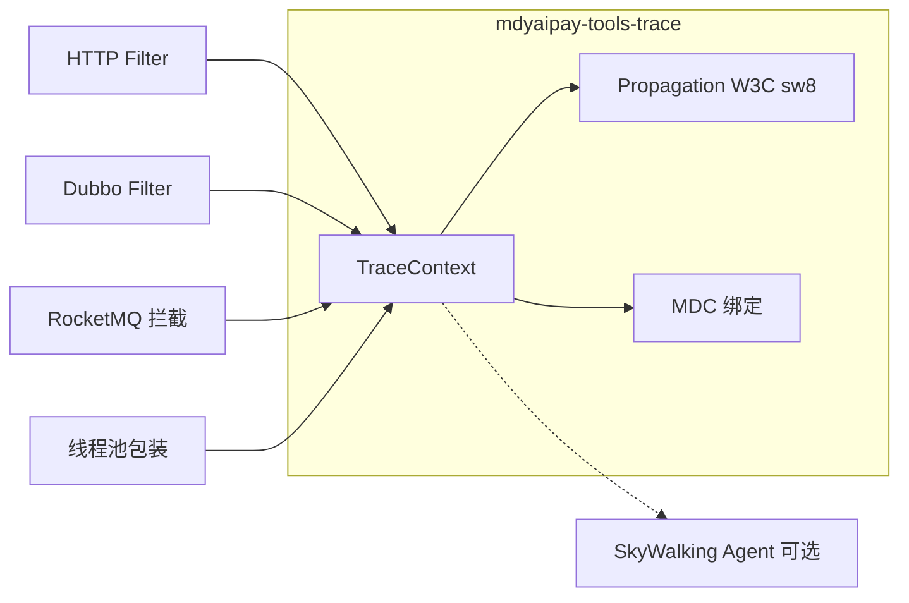

# 跨系统全链路跟踪设计（mdyaipay-tools-trace）

> **范围（已确认）：** 在 `mdyaipay-tools` 下新增 **Trace 传播与日志关联** 能力，覆盖 **HTTP、Dubbo、RocketMQ、多线程**；与现有 **SkyWalking Agent**、**@TimeTrace** 分工并存。  
> **Outbox：** 由 HTTP/Dubbo 触发的领域事件，**必须与原始请求同一 trace**；`domain_outbox` 增加 `trace_id` / `trace_parent` 字段，Relay 逐条恢复后再发 MQ。

---

## 1. 目标与非目标

### 1.1 目标

- 跨进程、跨协议传递 **同一 `traceId`**（W3C Trace Context），并在 **Log4j2 MDC**、**`ApiResponse.traceId`** 中可查询。
- 提供 **无 `-javaagent` 场景**（单测、部分 CI、本地未挂 Agent）下的最小可用链路关联。
- 与 **SkyWalking** 使用兼容传播头（`sw8` + `traceparent`），避免 Agent 开启时断链。
- **Gateway（WebFlux）→ Dubbo → payment/user**、**内网 HTTP**、**Outbox → RocketMQ → 消费者** 四条典型路径可验证。

### 1.2 非目标（第一期）

- tools 模块 **不向 OAP 上报 Segment/Span**（APM 仍由 Agent 负责）。
- 自研 Trace UI、采样中心、告警规则。
- 全量 **OpenTelemetry SDK** 导出（与仓库已选 SkyWalking 方案不重复建设）。
- Log-Trace 关联（SW-LTK）— 可列为 P4 文档联调项。
- 非 Java 语言传播（Node/Go 客户端仅约定 HTTP 头，不提供 SDK）。

---

## 2. 背景与现状

| 组件 | 现状 | 缺口 |
|------|------|------|
| `mdyaipay-tools-timetrace` | 单 JVM 方法耗时树 | 不跨线程、不跨进程（见 `docs/timetrace-design.md`） |
| `docs/skywalking-integration.md` | Agent + OAP，HTTP/Dubbo/JDBC | MQ 插件列为二期；无 Agent 时几乎无链 |
| `ApiResponse` | 每次响应 **独立** 12 位 UUID | 与真实链路无关 |
| `domain_outbox` + `OutboxMessageRelay` | 定时扫库发 MQ | 无 trace 字段，异步段断链 |

**设计原则：** tools 做 **上下文 + Carrier 注入/提取 + MDC**；SkyWalking 做 **Span 采集与拓扑**；TimeTrace 做 **方法级耗时**，报告 **附带** 当前 `traceId`。

---

## 3. 方案选型

| 方案 | 说明 | 结论 |
|------|------|------|
| A. 仅 SkyWalking Agent | 零改业务 | 禁 Agent、MQ、Outbox、线程池易漏；`ApiResponse` 仍脱节 |
| **B. tools 传播层 + Agent 并存** | W3C/`sw8` + Filter/拦截器 | **采用** |
| C. Micrometer Tracing + OTel | Boot 3 标准 | 与现有 SkyWalking 选型冲突 |

---

## 4. 总体架构

```text
商户 / 压测客户端
       │ HTTPS (traceparent / sw8)
       ▼
mdyaipay-gateway (WebFlux + Trace GlobalFilter)
       │ Dubbo attachments
       ▼
mdyaipay-payment / mdyaipay-user
       │ JDBC（Agent 可选 Span）
       │ INSERT domain_outbox (trace_id, trace_parent)
       ▼
OutboxMessageRelay（逐条 TraceContext.restore → MQ UserProperty）
       ▼
RocketMQ 消费者（extract → 子 spanId，traceId 不变）

并行：各进程 Log4j2 MDC[traceId]；ApiResponse 读 TraceContext；
可选：-javaagent → OAP UI
```



---

## 5. Maven 模块

在 `mdyaipay-tools/pom.xml` 聚合下新增：

| 模块 | ArtifactId | 职责 |
|------|------------|------|
| 核心 | `mdyaipay-tools-trace-core` | `TraceContext`、`TraceIds`、`Propagation`、线程包装；**仅 JDK** |
| 启动 | `mdyaipay-tools-trace-spring-boot` | AutoConfiguration、`mdyaipay.trace.*`、Servlet Filter、MDC、`TaskDecorator` |
| 协议（同 artifact 内分包 + optional 依赖） | （同上或拆子 module） | `http`、`dubbo`、`rocketmq` 的 Filter/拦截器，`@ConditionalOnClass` |

**依赖方向：**

```text
mdyaipay-gateway / mdyaipay-user / mdyaipay-payment / …
        ↓
mdyaipay-tools-trace-spring-boot
        ↓
mdyaipay-tools-trace-core
        ↓
mdyaipay-tools-common（ApiResponse 改造可选依赖 trace-core API）
```

父 POM `dependencyManagement` 增加上述 artifact 版本。业务模块按需引入 **一个** `mdyaipay-tools-trace-spring-boot` 即可（内部 optional 拉 Dubbo/MQ）。

**包名：** `com.mdyaipay.tools.trace`（与 `com.mdyaipay.tools.timetrace` 区分）。

---

## 6. 上下文模型

### 6.1 标识符

| 字段 | 格式 | 说明 |
|------|------|------|
| `traceId` | 32 位 hex（128-bit） | W3C，全链不变 |
| `spanId` | 16 位 hex | **当前进程段**；跨边界时生成 **子 spanId** |
| `parentSpanId` | 16 位 hex，可选 | 日志排障 |
| `sampled` | boolean | 与 Agent/`sw8` 对齐时可透传 |

### 6.2 TraceContext 存储

| 运行时 | 存储 |
|--------|------|
| Servlet / Dubbo 同步线程 | `ThreadLocal` |
| Spring Cloud Gateway / WebFlux | **Reactor `Context` + ThreadLocal 快照**；发起 Dubbo/阻塞调用前从 Context 取快照 |

**生命周期：** 入口 `bind` → `try/finally` 或 reactive `doFinally` → **`clear`**（含 MDC remove），防止线程池泄漏。

### 6.3 Baggage（可选，第一期可仅预留 API）

- 键值仅用于日志（如 `merchantId`），**禁止 PII**。
- 不进 W3C 标准段时走 `tracestate` 或内部 attachment，长度与键数量受限（配置 `max-baggage-*`）。

---

## 7. 传播契约

### 7.1 HTTP

| 位置 | 行为 |
|------|------|
| **Gateway** `GlobalFilter`（order ≈ `-1000`） | `extract(traceparent, sw8)`；无则 `startNew()`；写入 Reactor Context；响应可选 `traceparent` |
| **Spring MVC** `OncePerRequestFilter` | 同逻辑，ThreadLocal + MDC |
| **出站** `RestTemplate` / `WebClient` | `inject` 标准头 |

**头名称（常量类 `TraceHeaders`）：**

- `traceparent`（W3C，优先）
- `tracestate`（可选）
- `sw8`（与 SkyWalking Java Agent 插件一致，Agent 同开时双写）

### 7.2 Dubbo

| Filter 顺序 | 侧 | 行为 |
|-------------|-----|------|
| Consumer | 出站 | 当前 TraceContext → `RpcContext` attachment（`traceparent` 字符串 + 可选 `sw8`） |
| Provider | 入站 | attachment → `extract` → bind → `invoke` → `clear` |

Dubbo **3.3.2** / Triple 与 dubbo 协议共用 attachment；attachment key 与 SW Dubbo 插件文档对齐，**禁止各服务自定义键**。

### 7.3 RocketMQ

| 阶段 | 行为 |
|------|------|
| **发送** | `Message` UserProperty：`traceparent`（必选）、`sw8`（可选） |
| **消费** | `@RocketMQMessageListener` 入口 AOP 或 `MessageListener` 包装：`extract` → 新 child `spanId` → 业务 |

**Spring 集成点：** 包装 `RocketMQTemplate.syncSend` / `asyncSend` 路径；或提供 `TraceRocketMqMessageBuilder` 供 `OutboxMessageRelay` 调用。

### 7.4 Outbox（已确认：严格同 trace）

**语义：** Outbox 行代表 **同一业务事务的异步出站**；trace 跟随 **业务因果**，不跟随 **扫库调度线程**。

**表结构变更**（在现有 `domain_outbox` 上扩展，Flyway/init-schema 迁移）：

```sql
ALTER TABLE domain_outbox
    ADD COLUMN trace_id      VARCHAR(32)  NULL COMMENT 'W3C traceId，写库时从 TraceContext 捕获',
    ADD COLUMN trace_parent  VARCHAR(55)  NULL COMMENT '完整 traceparent，Relay 时直接 restore';
```

| 阶段 | 规则 |
|------|------|
| **INSERT outbox**（仍在 HTTP/Dubbo 请求线程） | 若 `TraceContext` 存在：写 `trace_id` + `trace_parent`；若不存在（纯后台）：两字段 **NULL** |
| **`OutboxMessageRelay.relayPendingMessages`** | **禁止**为整次 `@Scheduled` 包一层批处理 trace；**对每条** pending：`TraceContext.run(restoredFromRow, () -> syncSend + markSent)` |
| **NULL trace** | Relay 时 **新起 trace**，日志标记 `traceSource=outbox-relay-no-parent` |
| **重试投递** | 仍用该行 **原** `trace_id`，不随重试变更 |

**领域模型：** `DomainOutboxMessage` / `DomainOutboxRow` 增加字段；`MerchantAuditOutboxRecorder`（及同类）在 insert 前从 `TraceContext.current()` 赋值。

### 7.5 多线程

| 场景 | 机制 |
|------|------|
| `ExecutorService` | `TraceExecutors.wrap(executor)` |
| Spring `@Async` | `TaskDecorator` 注册（AutoConfiguration） |
| `CompletableFuture` | `TraceContext.supplyAsync` / `runAsync` |
| 手动 `new Thread` | 文档要求使用 `TraceRunnable` / `TraceCallable` |

跨线程：**traceId 不变**，**新 spanId**（便于区分线程段）。

---

## 8. 与 ApiResponse / TimeTrace / SkyWalking

### 8.1 ApiResponse

- `ok` / `fail` 的 `traceId` 改为 **`TraceContext.currentTraceId()` 的展示形式**（建议响应仍用 12 位：取 32 位 hex 的后 12 位或约定截断规则，**全链路透传仍用 32 位**）。
- 无上下文时（极少数）：回退 `newTraceId()` 并打 DEBUG 日志。

### 8.2 TimeTrace

- `TimeTraceReport` / 格式化输出增加 **可选** `traceId` 字段（读 TraceContext，不生成）。
- 不改变 TimeTrace 会话与 AOP 语义（见 `docs/timetrace-design.md`）。

### 8.3 SkyWalking

- 生产：**采样与 Span 以 Agent 为准**（见 `docs/skywalking-integration.md`）。
- tools **不重复上报** OAP；仅保证头与 attachment 与 Agent 插件一致。
- Gateway 仍需 **Gateway 4.x / WebFlux 6.x 插件** 才有完整 Span；tools Filter 保证 **无 Agent 时日志/MQ 不断链**。

---

## 9. 配置（`mdyaipay.trace.*`）

```yaml
mdyaipay:
  trace:
    enabled: true
    propagation:
      w3c: true
      sw8: true
    mdc:
      enabled: true
      trace-id-key: traceId
      span-id-key: spanId
    http:
      gateway-filter-enabled: true
      gateway-filter-order: -1000
      propagate-response-header: true
    dubbo:
      enabled: true
    rocketmq:
      enabled: true
      inject-on-send: true
    baggage:
      max-keys: 8
      max-value-length: 256
```

各模块可通过 `mdyaipay.trace.enabled=false` 关闭（单测默认关或用手动 `TraceContext.run`）。

---

## 10. 公共 API（core）

```java
/** 当前 traceId；无上下文时 empty */
Optional<String> TraceContext.currentTraceId();

/** 绑定上下文执行（Outbox relay、单测） */
<T> T TraceContext.run(TraceSnapshot snapshot, Callable<T> action);

/** Carrier 注入/提取（Filter 内部亦用） */
void Propagation.inject(Carrier carrier, TraceSnapshot snapshot);
TraceSnapshot Propagation.extract(Carrier carrier);
```

业务代码 **默认不手写 inject**；扩展点：Outbox 写库、自定义 MQ 发送。

---

## 11. 实施分期

| 阶段 | 交付 | 验收 |
|------|------|------|
| **P0** | trace-core + spring-boot Servlet Filter + MDC + Gateway Filter + `ApiResponse` | 网关 → payment 内网 HTTP：两服务日志 **同一 traceId** |
| **P1** | Dubbo Consumer/Provider Filter | gateway Dubbo → `PaymentGatewayFacade` 不断链 |
| **P2** | RocketMQ 发/收 + `domain_outbox` 字段 + Relay 逐条 restore | 审核 Outbox → MQ → 消费者同 traceId |
| **P3** | 线程池 / `@Async` + TimeTrace 报告带 traceId | 压测慢路径报告可对齐 MDC |
| **P4** | 文档：与 `run-mdyaipay-services-with-skywalking.sh` 联调；可选 LTK | UI trace 与日志 traceId 可对照 |

---

## 12. 测试策略

| 层级 | 内容 |
|------|------|
| trace-core | inject/extract 往返、非法 header、并发 ThreadLocal 清理 |
| http | MockMvc / WebTestClient 断言请求/响应头 |
| dubbo | Filter 单测 + gateway-payment 集成（可选 Testcontainers ZK） |
| rocketmq | UserProperty 往返；Outbox relay 单测（Mock Template + 断言 restore） |
| 回归 | `mdyaipay-tools-timetrace` 测试全绿 |

---

## 13. 风险与缓解

| 风险 | 缓解 |
|------|------|
| Agent 与 tools 双写 Span | tools **不上报**，只传播 |
| WebFlux 线程切换丢上下文 | Reactor Context 为主，Dubbo 调用前 **显式快照** |
| Outbox 批处理误用单 trace | 代码评审 + Relay 单测 **每条** 独立 restore |
| 性能 | Filter 仅字符串解析，无 JSON；Baggage 限长 |
| 安全 | Baggage 禁 PII；SQL 参数仍遵循 SW `trace_sql_parameters=false` 生产配置 |

---

## 14. 文档与引用

| 文档 | 关系 |
|------|------|
| `docs/timetrace-design.md` | 单进程耗时，报告增强 traceId |
| `docs/skywalking-integration.md` | APM 主路径，头兼容 |
| `docs/superpowers/specs/2026-09-17-user-system-design.md` §7.2 | Outbox 表定义，本设计 **追加** trace 列 |

---

## 15. 自检（Spec Review）

- [x] Outbox 同 trace 决策已写入 §7.4，无 TBD
- [x] 与 SkyWalking / TimeTrace 边界清晰，无重复上报
- [x] HTTP / Dubbo / MQ / 多线程均有接入点与验收
- [x] 范围可在一个 implementation plan 内分 P0–P4 落地

---

**下一步：** 用户审阅本文档后，使用 **writing-plans** 生成 `docs/superpowers/plans/2026-09-18-cross-system-trace.md` 实现计划。
