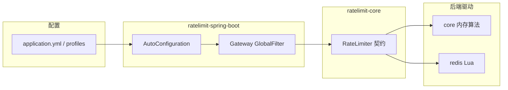
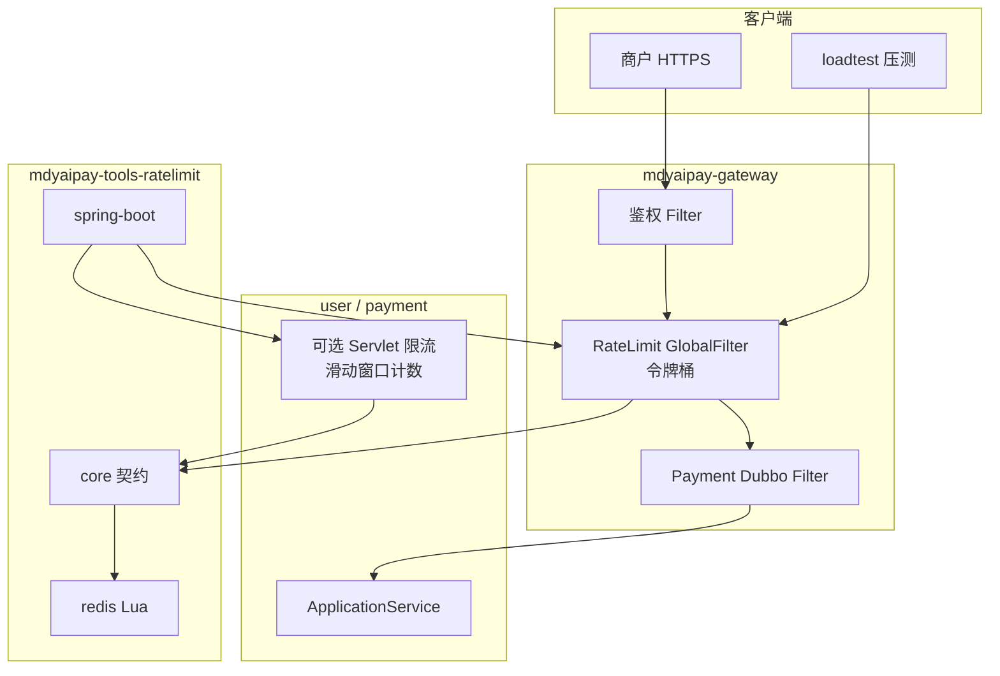

# 限流工具设计（mdyaipay-tools-ratelimit）

> **范围：** 在 `mdyaipay-tools` 下新增 **可插拔、可分布式** 的限流能力，参照 Redis 五类经典算法对比（固定窗口 / 滑动窗口计数 / 滑动窗口日志 / 令牌桶 / 漏桶），与网关「路由、鉴权、**限流**」职责对齐。  
> **默认落地策略（与对比结论一致）：** **网关入口 → 令牌桶**；**服务接口总量控制 → 滑动窗口计数**。

---

## 1. 目标与非目标

### 1.1 目标

- 提供 **统一限流契约**（`RateLimiter` + `RateLimitDecision`），业务与 gateway **只依赖 core 接口**，不绑定 Redis 或 Spring。
- 支持 **本地内存**（单测、单机 dev）与 **Redis + Lua**（多实例 gateway / user / payment）两种后端，通过 SPI 或显式装配切换。
- 首版实现图中 **五维对比** 里工程上最常用的三种：**固定窗口**、**滑动窗口计数**、**令牌桶**；滑动窗口日志、漏桶列为 **P2 扩展**（接口预留，避免 YAGNI 过早实现 ZSET/队列）。
- Spring Boot 自动配置：**Gateway GlobalFilter**（Reactive）、可选 **Servlet Filter**；返回 **429** + 标准响应头（`Retry-After`、`X-RateLimit-*`）。
- 限流键可组合：**商户 appKey**、**IP**、**路径/路由 id**、**自定义维度**（SPI `RateLimitKeyResolver`）。

### 1.2 非目标（首版）

- 不做全局限流控制台、动态规则下发中心（规则来自 `application.yml` 或后续配置中心对接点）。
- 不替代 Sentinel / Resilience4j 全功能（熔断、舱壁）；本模块 **只做速率限制**。
- 不在 core 内嵌 Redis 客户端；Redis 仅在子模块 `mdyaipay-tools-ratelimit-redis`（聚合目录 `mdyaipay-tools-ratelimit/` 下）。
- 不做跨地域多 Redis 集群的 CRDT 限流（单 Redis 或 Redis Cluster 单 key 原子 Lua 即可）。

---

## 2. 算法选型（对照五维对比）

| 算法 | Redis 结构 | 写入复杂度 | 内存（量级） | 突发 | 分布式风险 | 本仓库定位 |
|------|------------|------------|--------------|------|------------|------------|
| 固定窗口 | `String` + `INCR` | O(1) | 最低 | 窗口边界双倍突发 | 低 | P1：运维简单、非核心接口 |
| **滑动窗口计数** | `Hash` 分段 `HINCRBY` | O(1) | 约为固定窗口 2～3 段 | 可控 | 中（多段竞态，Lua 原子） | **P1 默认：服务接口** |
| 滑动窗口日志 | `ZSET` | O(log N) | 高（每请求一条） | 最平滑 | 高 | P2：极高精度场景 |
| **令牌桶** | `Hash`（tokens + ts） | O(1) Lua | 低 | **允许合理突发** | 中（Lua 原子） | **P1 默认：网关入口** |
| 漏桶 | List/Stream | 入出队 | 中～高 | 强制平滑 | 高 | P2：严格整形出站 |

**深度结论（设计采纳）：**

- **滑动窗口计数**：用「分段计数」换「内存可控」，精度接近滑动日志，内存约为日志方案的约 1/15；适合 **payment/user 对内 Dubbo 或 HTTP 接口** 的总量控制。
- **令牌桶 vs 漏桶**：二者偏 **流量整形**；网关需要 **允许合理突发、保护下游**，选 **令牌桶**；漏桶留作出站回调等「强制匀速」场景扩展。
- **固定窗口**：仅用于低 QPS、可接受边界突刺的管理接口或开发环境。

---

## 3. 模块结构（对齐 `mdyaipay-tools-loadtest`）

与 loadtest 相同：**`mdyaipay-tools` 只挂一个聚合父工程** `mdyaipay-tools-ratelimit`（`packaging=pom`），可发布 jar 均在子目录内；示例规则 YAML 放在聚合目录 `profiles/`（类比 loadtest 的 `scenarios/`）。

```
mdyaipay-tools-ratelimit/                    (packaging=pom，类比 loadtest 父工程)
├── mdyaipay-tools-ratelimit-core            契约、策略模型、内存算法、键解析 SPI
├── mdyaipay-tools-ratelimit-redis           Lettuce + Lua 分布式驱动
├── mdyaipay-tools-ratelimit-spring-boot     自动配置、Gateway/Servlet 过滤器
└── profiles/                                示例/文档用规则片段（非运行时必选）
```

| Artifact | 包根 | 职责 |
|----------|------|------|
| `mdyaipay-tools-ratelimit` | — | Maven 聚合，**不可**作为业务依赖引入 |
| `mdyaipay-tools-ratelimit-core` | `com.mdyaipay.tools.ratelimit` | `RateLimiter`、`RateLimitPolicy`、`RateLimitAlgorithm`、`RateLimitDecision`、内存实现、键解析 SPI |
| `mdyaipay-tools-ratelimit-redis` | `com.mdyaipay.tools.ratelimit.redis` | 各算法 Lua 脚本、Lettuce、`RedisRateLimiter` 工厂 |
| `mdyaipay-tools-ratelimit-spring-boot` | `com.mdyaipay.tools.ratelimit.autoconfigure` | `mdyaipay.ratelimit.*`、Gateway GlobalFilter、可选 Servlet Filter |



**依赖原则（与 loadtest 一致）：**

| 模块 | 依赖 |
|------|------|
| `ratelimit-core` | 仅 JDK + `slf4j-api` |
| `ratelimit-redis` | `ratelimit-core` + Lettuce |
| `ratelimit-spring-boot` | `ratelimit-core`；`ratelimit-redis`、`common-core`、Gateway 为 **optional** |
| `mdyaipay-gateway` | 仅引入 **`mdyaipay-tools-ratelimit-spring-boot`**（按需传递 redis） |

- 业务模块 **不** 依赖 `mdyaipay-tools-ratelimit` 聚合 POM，与 loadtest 不直接依赖 `mdyaipay-tools-loadtest` 父 artifact 相同。
- payment domain **不得** 内嵌 Redis 限流键或 INCR 逻辑。

父 `mdyaipay-tools/pom.xml` 增加 **一个** `<module>mdyaipay-tools-ratelimit</module>`；根 `dependencyManagement` 锁定三个子 artifact 版本。

---

## 4. 核心 API

### 4.1 单次判定

```java
/**
 * 限流器端口：一次 acquire 对应一次业务请求（或一次 Dubbo 调用）的配额消耗。
 */
public interface RateLimiter {

    /**
     * 尝试获取 1 单位配额。
     *
     * @param key  限流维度键（如 merchant:mk_xxx、route:collect、ip:1.2.3.4）
     * @param policy  算法、阈值、窗口等（不可变）
     * @return 是否允许及剩余配额、建议重试间隔
     */
    RateLimitDecision tryAcquire(String key, RateLimitPolicy policy);
}
```

```java
/** 限流判定结果：供 Filter 写 429 与响应头。 */
public record RateLimitDecision(
        boolean allowed,
        long remaining,
        long limit,
        Duration retryAfter,
        RateLimitAlgorithm algorithm
) {}
```

### 4.2 策略与算法

```java
public enum RateLimitAlgorithm {
    FIXED_WINDOW,
    SLIDING_WINDOW_COUNTER,
    TOKEN_BUCKET
    // P2: SLIDING_WINDOW_LOG, LEAKY_BUCKET
}

public record RateLimitPolicy(
        RateLimitAlgorithm algorithm,
        long limit,              // 窗口内最大请求数，或桶容量（令牌桶）
        Duration window,         // 固定/滑动窗口长度；令牌桶为 refill 周期
        double refillRatePerSecond, // 仅 TOKEN_BUCKET：每秒补充令牌数
        int slidingSegments      // 仅 SLIDING_WINDOW_COUNTER，默认 3～5
) {}
```

### 4.3 键解析（Gateway / 业务扩展）

```java
public interface RateLimitKeyResolver {
    /** 返回 null 表示本规则不适用，跳过。 */
    String resolve(RateLimitContext context);
}

public record RateLimitContext(
        String routeId,
        String httpMethod,
        String path,
        String clientIp,
        String merchantAppKey,
        Map<String, String> attributes
) {}
```

Spring 侧可注册多个 `RateLimitKeyResolver`，按规则配置 `keyTemplate` 或 `resolverBeanName`。

---

## 5. Redis 实现要点

**Key 命名：** `mdyaipay:rl:{algorithm}:{logicalKey}`，避免与其他业务 key 冲突。

| 算法 | Lua 思路 | 原子性 |
|------|----------|--------|
| 固定窗口 | `INCR` + `EXPIRE` 对齐窗口起点 | 单 key 脚本 |
| 滑动窗口计数 | 当前段 + 上一段权重插值（或纯分段计数求和） | 单 Hash，`HINCRBY` + 过期字段 |
| 令牌桶 | 读 tokens、lastRefillMs，按 elapsed 补 token，不足则拒绝 | 单 Hash 两字段 |

- 所有脚本 **EVALSHA** + 启动时 `SCRIPT LOAD`，失败时降级 `EVAL`。
- **时钟**：以 Redis `TIME` 或 Lua 内 `redis.call('TIME')` 为准，避免应用节点时钟漂移导致桶计算错误。
- **Cluster**：限流 key 带 hash tag `{merchantId}` 当需要与商户数据共槽时可选；默认单 key 无 tag 即可。

**连接：** Lettuce 异步客户端；`RedisRateLimiter` 构造注入 `StatefulRedisConnection` 或 `RedisClient` + 连接池配置来自 `mdyaipay.ratelimit.redis.*`。

---

## 6. 内存实现（core）

用于 **单元测试** 与 **未配 Redis 的本地启动**：

- `InMemoryFixedWindowRateLimiter`
- `InMemorySlidingWindowCounterRateLimiter`
- `InMemoryTokenBucketRateLimiter`

使用 `ConcurrentHashMap` + 每 key 轻量状态；**不保证跨 JVM**。文档与 `@ConditionalOnMissingBean(RedisRateLimiter)` 明确标注。

---

## 7. Spring Boot 集成

### 7.1 配置前缀

```yaml
mdyaipay:
  ratelimit:
    enabled: true
    backend: redis   # memory | redis
    redis:
      uri: redis://127.0.0.1:6379
      timeout: 200ms
    default-policy:
      algorithm: TOKEN_BUCKET
      limit: 500
      window: 1s
      refill-rate-per-second: 500
    rules:
      - id: gateway-collect
        match:
          path: /api/v1/payments/collect
          methods: [POST]
        policy:
          algorithm: TOKEN_BUCKET
          limit: 300
          window: 1s
          refill-rate-per-second: 300
        key-resolvers: [merchantAppKey, clientIp]  # 组合键用 : 连接
      - id: merchant-api-default
        match:
          path: /api/v1/**
        policy:
          algorithm: SLIDING_WINDOW_COUNTER
          limit: 1000
          window: 60s
          sliding-segments: 5
        key-resolvers: [merchantAppKey]
```

### 7.2 Gateway

- `RateLimitGatewayFilter`（GlobalFilter，`Order` 在鉴权之后、转发之前）：解析 `RateLimitContext` → 匹配第一条 rule → `tryAcquire` → 拒绝则 **429** + JSON `ApiResponse`（复用 `mdyaipay-tools-common` 错误码，新增 `RATE_LIMITED`）。
- 响应头：`Retry-After`（秒）、`X-RateLimit-Limit`、`X-RateLimit-Remaining`（可选）。

### 7.3 Servlet（user / payment）

- 可选 `RateLimitFilter`（`@ConditionalOnWebApplication(SERVLET)`），同样 rule 模型；**默认关闭**，按接口显式开启。

### 7.4 Dubbo

- P2：`RateLimitClusterFilter` 或 Provider Filter，键为 `interface:method + merchantId`；首版不实现，仅在 core 预留 `RateLimitContext` 字段。

---

## 8. 与现有组件关系



- **Trace**：限流拒绝时 `TraceEntry` 仍记录，`outcome=rate_limited`，便于与压测报告对照。
- **Loadtest**：现有 `gateway-collect-50k` 可在开启限流后增加 **429 比例** 断言场景（P2 场景文件）。

---

## 9. 错误码与 HTTP 语义

| 场景 | HTTP | 业务码（建议） |
|------|------|----------------|
| 超过配额 | 429 | `RATE_LIMITED`（tools-common 枚举扩展） |
| Redis 超时 | 503 或 fail-open（可配置） | `RATE_LIMIT_BACKEND_UNAVAILABLE` |

**fail-open vs fail-closed：** 生产 gateway 默认 **fail-closed**（Redis 不可用则 503）；本地 dev 可 `fail-open: true` 仅打 WARN 日志。

---

## 10. 测试策略

| 层级 | 内容 |
|------|------|
| core 单测 | 三算法内存实现：边界窗口、突发令牌、滑动段精度（容差断言） |
| redis 单测 | Testcontainers `redis:7` 或本地 `redis7`；Lua 并发 32 线程不超卖 |
| spring 单测 | `@SpringBootTest` + Mock Redis / 内存 backend；Gateway WebTestClient 429 |
| 集成 | Docker compose：gateway + redis7；小流量场景 0% 429，超限 appKey 100% 429 |

---

## 11. 实施分期

| 阶段 | 交付 |
|------|------|
| **M1** | `mdyaipay-tools-ratelimit-core`：契约 + 内存三算法 + 单测 |
| **M2** | `mdyaipay-tools-ratelimit-redis`：三算法 Lua + Lettuce |
| **M3** | `mdyaipay-tools-ratelimit-spring-boot`：配置 + Gateway Filter + 429 响应 |
| **M4** | `mdyaipay-gateway` 引入依赖，默认 collect 路由令牌桶；文档与 `modules.md` |
| **P2** | 滑动窗口日志、漏桶、Dubbo Filter、动态规则 |

---

## 12. 自检（设计原则）

- **S**：core / redis / spring-boot 分层；gateway 只装配 Filter，算法在 tools。
- **KISS**：首版三算法 + 一种 Redis 客户端；规则静态 YAML。
- **DRY**：Lua 与内存实现共用 `RateLimitPolicy` 语义测试向量（参数化测试）。
- **YAGNI**：不实现 ZSET 日志与漏桶直至有明确接口需求。
- **SOC**：payment 领域不包含限流 Redis 键名或 INCR 逻辑。

---

## 13. 待确认项（已拍板）

1. **Redis 地址**：本地默认 `redis://127.0.0.1:6379`（与现有 `redis7` 容器一致）；可用 `MDYAIPAY_RATELIMIT_REDIS_URI` 覆盖。
2. **collect 默认频率**：与压测对齐为 **300/s 令牌桶**（gateway `application.yml` 规则 `gateway-collect`）。
3. **实施**：M1–M4 已按 `docs/superpowers/plans/2026-09-20-ratelimit-m*-*.md` 落地；P2（滑动日志、漏桶、Dubbo Filter、动态规则）另议。
